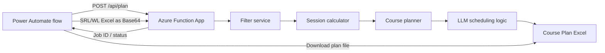

I’ll ground the replacement deck in the current planner implementation and its Azure Function/Power Automate flow, then provide a slide-by-slide version matching the template’s structure.

Read , lines 1 to 400

Read 

Read 

Read 

Read 

The deployed surface confirms the core request path: Power Automate posts an SRL/WL workbook to the `/Plan` Azure Function, which starts a planning job; separate endpoints expose status and the generated Excel file. I’m checking the job orchestration and function routes so the deck describes the implemented flow, not a generic concept.

Searched for regex `def (generate|create|plan)|apply_filters|CoursePlan|CourseSession|output_file|job_id` (`**/smart_coarse_planner/services/planner_service.py`), 7 results

Read , lines 1 to 400

Read 

Read 

Read 

Read , lines 400 to 850

Read , lines 1100 to 1289

Read 

Read 

The planning logic is specific enough to replace the generic storyline: it filters the SRL/WL request data, calculates sessions from demand and course capacity, uses trainer priorities and leave dates to produce a schedule, and writes an Excel plan with availability and utilization sheets. Since no editable `.pptx` was supplied, I’ll provide presentation-ready text rather than altering source code.

## Slide 1 — Title

**SMART COURSE PLANNER**  
Automated course scheduling from training demand to a feasible course plan

**Phase 1: Azure Function and Power Automate integration**

---

## Slide 2 — Current challenge

Manual course planning requires combining multiple inputs:

- Student Request List (SRL/WL)
- Course capacity and duration
- Trainer qualification and priority
- Trainer leave and availability
- Training locations, labs, and rooms

This takes time and makes schedule conflicts difficult to identify early.

---

## Slide 3 — Smart Course Planner solution

Smart Course Planner generates a course schedule automatically.

- Reads the SRL/WL Excel input
- Filters relevant training requests
- Calculates required sessions per course
- Assigns available trainers according to priority
- Schedules sessions within the planning period
- Produces a course-plan Excel file for review and follow-up

---

## Slide 4 — Input data and rules

**Training demand**

- Student requests per course from SRL/WL Excel
- Course code, title, modality, and requested site

**Course rules**

- Maximum capacity per course
- Number of training days
- Classroom assignment

**Trainer rules**

- Trainer priority per course
- Leave dates and part-time availability
- One trainer cannot teach overlapping sessions
- Training is planned on working days only

---

## Slide 5 — Planning process

**1. Filter requests**  
SRL/WL data is filtered for the relevant modality and sites.

**2. Calculate sessions**  
The solution calculates $ceil(\text{students interested} / \text{course capacity})$.

**3. Generate course plan**  
The planning engine assigns dates and trainers based on priority, availability, leave dates, and course duration.

**4. Create plan workbook**  
The generated Excel file includes the scheduled sessions and planning views.

---

## Slide 6 — Technical architecture

- Power Automate is the user-facing orchestration layer.
- The Azure Function App hosts the planning API.
- The planner runs the complete scheduling workflow after the Plan API call.

---

## Slide 7 — Power Automate flow

**Current flow**

1. Manually trigger a flow  
2. Get the SRL/WL Excel file  
3. Call the Azure Function Plan API using HTTP  
4. Store the API response  
5. Retrieve the generated course-plan Excel file  
6. Create the output file in the target SharePoint or OneDrive location  

**Current scope:** the Power Automate flow now calls the Plan API.

---

## Slide 8 — Azure Function APIs

| API | Method | Purpose |
|---|---|---|
| `/api/plan` | POST | Starts a planning job with the uploaded Excel file |

**Plan request body**

- `file_name`
- `file_content_base64`
- `input` (optional)

---

## Slide 9 — Planner output

The generated Excel workbook contains:

- **Course Plan**: course code, course name, session number, dates, trainer, location, and training room
- **Trainer Availability**: teaching assignments, leave days, weekends, and part-time indicators
- **Lab Availability**: room usage across the planning period
- **Course Overview**: course demand, sessions, and planning coverage
- **Utilization Metrics**: trainer and lab utilization

---

## Slide 10 — Phase 1 status and next steps

**Phase 1 implemented**

- Azure Function App hosts the Plan API
- Power Automate calls the planning endpoint
- Excel input is processed automatically
- Course-plan Excel output is generated

**Next steps**

- Connect the generated file directly to the required SharePoint output location
- Add status polling in Power Automate until the job completes
- Validate results with training planners
- Define production security and storage for Azure deployment
- Extend the planner with additional business rules as needed